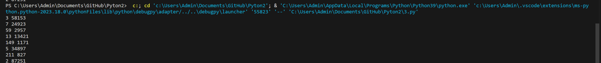

#Отчёт
## Прог. Лабораторная работа №6
Расчётные задачи. Itertools

Сложность:
Rare
1.Напишите программу для решения задач своего варианта.
2.Оформите отчёт в README.md. Отчёт должен содержать:
Условия задач
Описание проделанной работы
Скриншоты результатов
Ссылки на используемые материалы

Вариант 1
### Задание 1 
Тимофей составляет 5-буквенные коды из букв Т, И, М, О, Ф, Е, Й. Буква Й может использоваться в коде не более одного раза, при этом она не может стоять на первом месте, на последнем месте и рядом с буквой И. Все остальные буквы могут встречаться произвольное количество раз или не встречаться совсем. Сколько различных кодов может составить Тимофей?

 моя программа 1
```python
import itertools
alphabet = "ТИМОФЕЙ"
ar = itertools.product(alphabet, repeat=5) 
arl = []
for i in ar:
    arl.append(list(i))
count = 0
for e in arl:
    flag = True
    for i in range(len(e) - 1):
        if e.count('Й') > 1 or e[0] == 'Й' or e[-1] == 'Й' or (e[i] == 'Й' and e[i + 1] == 'И') or (e[i + 1] == 'Й' and e[i] == 'И'):
            flag = False
    if flag == True: count += 1
print(count)
```
результат моей программы 1


### Задание 2


  моя программа 2
```python
x = 4**2020 + 2**2017 - 15
s = ''
while x != 0: 
    s += str(x % 2)
    x //= 2
s = s[::-1]
print(s.count("1"))
```
результат моей программы 2

### Задание 3 


 моя программа 3
```python
for x in range(174457,174505+1):
    k=0
    s=[]
    for y in range(2,x//2+1):
        if x%y==0:
            k+=1
            s.append(y)
            if k>2:
                break
    if k==2:
        print(*s)
```
результат моей программы 3

